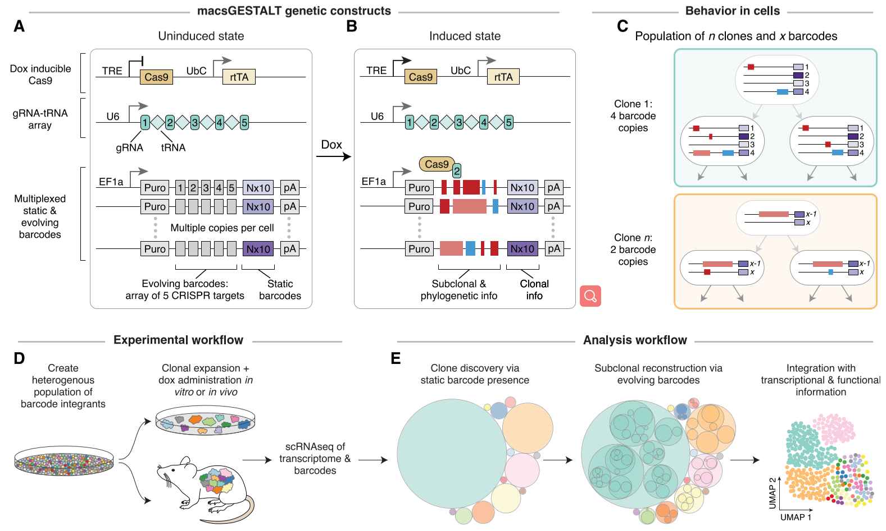
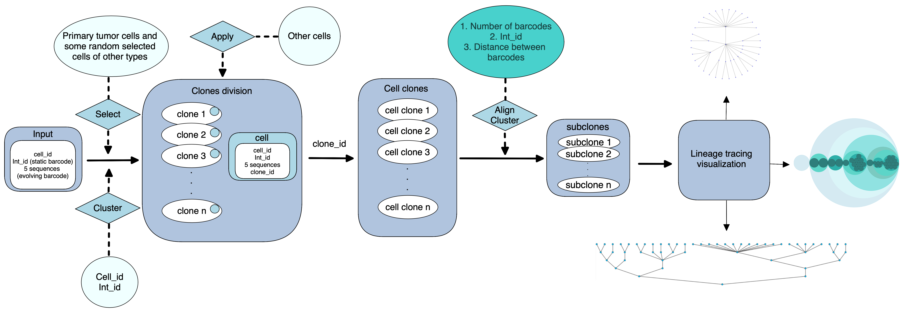

---
output:
  pdf_document: default
  html_document: default
---

# Lineage Tree Reconstruction with macsGESTALT

## Background

Single-cell lineage tracing technology enables an unprecedented exploration of lineage history and transcriptional states. By tracking clonal relationships at the single-cell level, this method has led to a new level of understanding of several biological processes, such as clonal evolution (Wagner *et al.*, 2020).

macsGASTALT (multiplexed, activatable, clonal and subclonal GESTALT) is an inducible CRISPR-Cas9-based single-cell lineage tracing method. Each cell is cotransfected with three genetic constructs, dox-inducible Cas9, the gRNA array and multiplexed barcodes. The gRNA array consists of 5 differ-ent gRNA separated by tRNA sequences, and each barcode consists of a static 10bp region and 250bp evolving region that contains 5 CRISPR-Cas9 target sites. After the doxycycline induction, Cas9 expression is triggered, and the individual gRNAs that are randomly released from the gRNA array can guide the Cas9 to edit the evolving regions. As a result, transfected cells will contain a random number of integrated barcodes, and these cells are used for in vivo or in vitro studies (Simeonov *et al.*, 2021).

In this method, the static barcodes in each cell remain unchanged throughout the development, which enables the discovery of origin clones. With the inducible CRISPR-Cas9 system, the evolving region of barcodes changed progressively (Simeonov *et al.*, 2021). During the continuous cell division, the evolving regions are edited and inherited, thus providing phylogenetic or subclonal information for bioinformatic analyses (Simeonov *et al.*, 2021). Based on static and dynamic barcode information generalized from the macsGASTALT technique and single cell sequencing, our group designed a pipeline that reconstructs the phylogenetic trees of lineage history with the identification of cell clones and subclones.



## Install

You can directly download this package from GitHub.

## Seting up running environment

| Package    | Version |
|------------|---------|
| circlify   | 0.15.0  |
| graphiz    | 0.20.1  |
| igraph     | 0.10.2  |
| matplotlib | 3.6.2   |
| networkx   | 2.8.8   |
| numpy      | 1.23.5  |
| pandas     | 1.5.2   |
| pygraphiz  | 1.10    |
| python     | 3.8.15  |

## Input

Barcode datasets sequenced from macsGESTALT technique, which should includes information such as cell barcode IDs, static barcode IDs, evolving barcode sequences (1-5).

## Usage and Parameters 

``` python
$ python3 
# Prints out the standard-readme spec
```

## Analysis Workflow

The analysis workflow of this algorithm project can be divided into four steps.



## Output

A *.txt* file contains a list describes clone and subclone information of cells, which can be
used for visualization, and also some figures that visualize clones and subclones information. Stored in the different directories. 

## References

Simeonov, K. P., Byrns, C. N., Clark, M. L., Norgard, R. J., Martin, B., Stanger, B. Z., Shendure, J., McKenna, A., & Lengner, C. J. (2021). Single-cell lineage tracing of metastatic cancer reveals selection of hybrid EMT states. Cancer cell, 39(8), 1150--1162.e9. <https://doi.org/10.1016/j.ccell.2021.05.005>

Wagner, D. E., & Klein, A. M. (2020). Lineage tracing meets single-cell omics: opportunities and challenges. Nature reviews. Genetics, 21(7), 410--427. <https://doi.org/10.1038/s41576-020-0223-2>

## Maintainers

Group 4 \@

## Contributing

Feel free to contact us and join in!

## License

[MIT](LICENSE)
